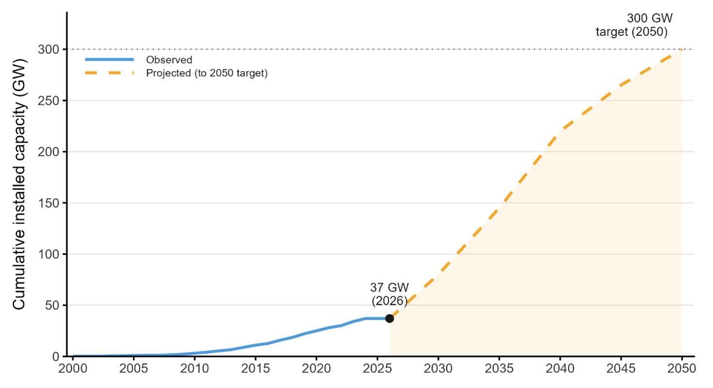
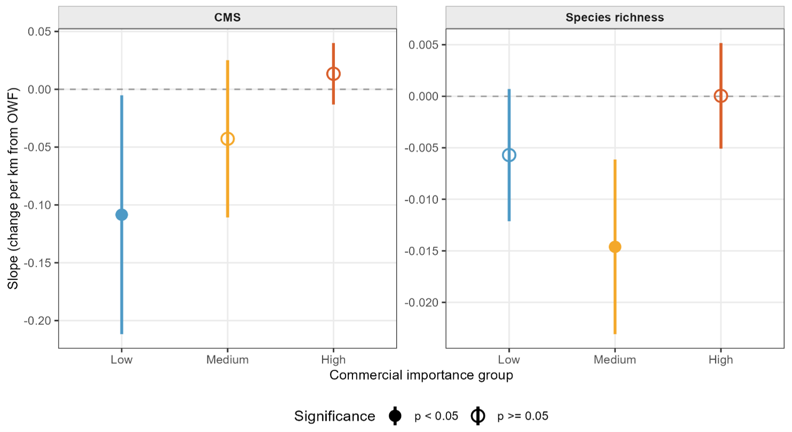
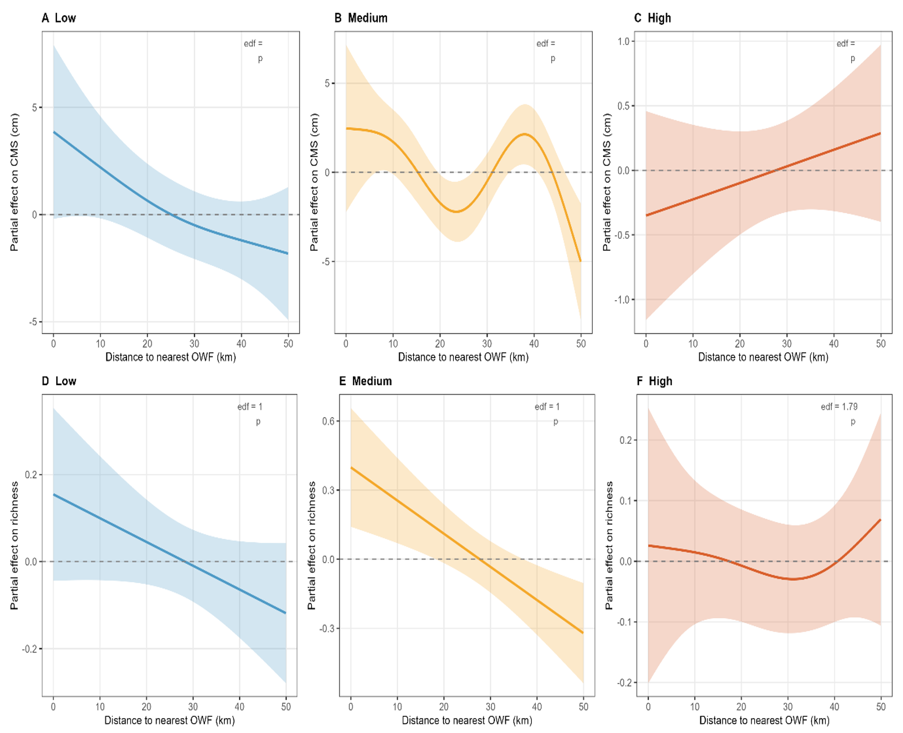
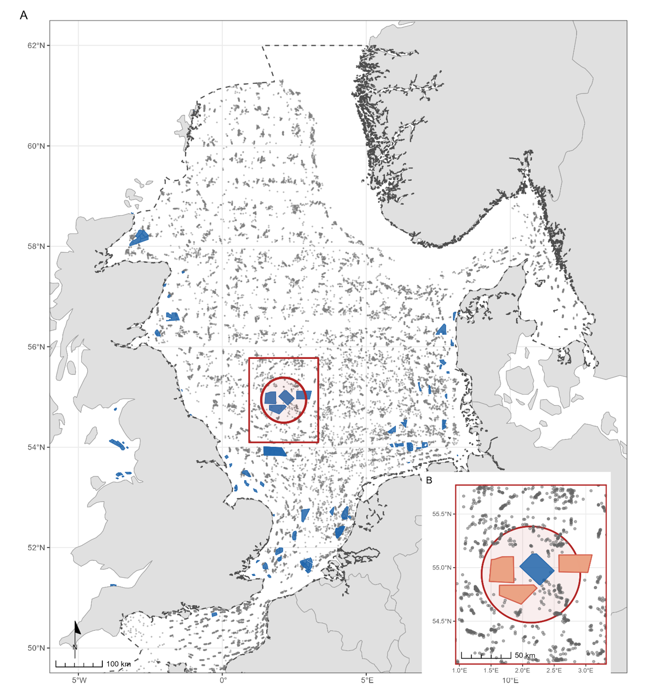

# BSc Dissertation: North Sea Fisheries and Offshore Wind Farms

Geostatistical analysis of offshore wind farm influence on demersal fish community structure in the Greater North Sea.

**Author:** Kaspar Szpojnarowicz
**Institution:** University of Sheffield
**Year:** 2026

## Project Overview

This project investigates whether the presence of offshore wind farms (OWFs) in the Greater North Sea is associated with changes in demersal fish community structure, using ICES trawl survey data from 1993 to 2020 across 122 OWFs. Two community level metrics are analysed, Community Mean Size (CMS) and species richness, across three commercial importance groups (Low, Medium, High) classified using FishBase.

Offshore wind capacity is expanding rapidly [confirm source and region for the figure below], from roughly 37 GW in 2026 towards a 300 GW target by 2050. That growth is the practical motivation for this analysis: understanding how OWFs affect fish communities matters more as more of them get built.


*Figure 1. Cumulative installed OWF capacity, observed to 2026 and projected to the 2050 target. [Add source citation once confirmed.]*

The analysis addresses two research questions:

- **RQ1:** Does community structure vary linearly with distance to the nearest OWF, after controlling for environmental covariates?
- **RQ2:** Is that relationship non-linear or non-monotonic, consistent with the reef effect or fishing-the-line hypothesis?

## Key Findings

**RQ1, linear models (`07_linear_models.R`).** Covariate adjusted linear models test whether CMS and richness change linearly with distance to the nearest OWF. The effect is not uniform across commercial groups: CMS declines significantly with distance only in the low commercial value group, while richness declines significantly only in the medium commercial value group. Neither metric shows a significant linear effect in the high commercial value group.


*Figure 2. Estimated slope (change per km from nearest OWF) for CMS and species richness, by commercial importance group. Filled points are significant at p < 0.05, open points are not.*

**RQ2, GAMs (`08_gam_models.R`).** Allowing for non-linear smooth terms reveals shapes the linear models miss:

- **Low commercial value:** both CMS and richness are highest close to OWFs and decline with distance, consistent with a reef effect for this group.
- **Medium commercial value:** the CMS relationship is non-monotonic (a dip around 20 to 25 km followed by a partial recovery around 35 to 40 km), while richness declines roughly linearly with distance.
- **High commercial value:** the CMS pattern reverses direction, rising slightly with distance rather than falling, while richness stays close to flat across the full range.


*Figure 3. Partial effects of distance to nearest OWF on CMS (top row) and species richness (bottom row), by commercial importance group. [Insert exact edf and p values from the `08_gam_models.R` console output, the panel labels in this figure are currently blank and need fixing at the source.]*

**Study area.** All hauls and OWF polygons used in the analysis, with the 50 km buffer methodology used to assign each haul a distance to the nearest OWF cluster.


*Figure 4. Study area across the Greater North Sea (panel A), with the buffer methodology used to assign each haul a distance to the nearest OWF cluster (panel B).*

## Data Sources

- **Trawl survey data:** Lynam, C.P. & Ribeiro, J. (2022). GNSIntOT1 NE Atlantic Groundfish Survey. Cefas Data Portal. https://data.cefas.co.uk/ Accessed [Month Year].

- **Offshore wind farm polygons:** EMODnet Human Activities (2026). Offshore Wind Farms (Polygons). European Marine Observation and Data Network. https://emodnet.ec.europa.eu/ Accessed [Month Year].

- **ICES ecoregion boundaries:** International Council for the Exploration of the Sea (2017). ICES Ecoregions. https://www.ices.dk/ Accessed [Month Year].

- **Species commercial importance classifications:** Froese, R. and D. Pauly. Editors. (2026). FishBase. World Wide Web electronic publication. www.fishbase.org Accessed via the rfishbase R package (Boettiger et al., 2012).

## Repository Structure

```
.
├── data/
│   ├── raw/                              # Raw inputs, not tracked, see Data Sources
│   └── processed/                        # Derived data written by scripts 01 to 06
├── outputs/
│   ├── figures/                          # Final figures (PNG)
│   └── tables/                           # Final summary tables (CSV)
├── scripts/
│   ├── 00_setup.R                        # Shared libraries, plotting theme, colour palette
│   ├── 01_owf_polygons.R                 # Load and clean OWF polygons
│   ├── 02_haul_owf_distance.R            # Distance from each trawl haul to nearest OWF
│   ├── 03_fishbase_commercial_groups.R   # Classify species by commercial importance (FishBase)
│   ├── 04_community_metrics.R            # Compute CMS and species richness per haul
│   ├── 05_build_haul_metrics.R           # Merge haul level metrics into one table
│   ├── 06_add_covariates.R               # Add depth, SBT, SST trend, distance to coast
│   ├── 07_linear_models.R                # RQ1: adjusted vs unadjusted linear models
│   ├── 08_gam_models.R                   # RQ2: GAMs for non-linear and non-monotonic effects
│   ├── 09_figures.R                      # Final figures for the write up
│   └── exploratory/                      # Supplementary analysis, not part of the main pipeline
├── .gitignore
├── LICENSE
└── README.md
```

## How to Run

**Requirements:** R (≥ 4.2 recommended; exact version not currently pinned). Packages used: `sf`, `terra`, `tidyverse`, `here`, `janitor`, `mgcv`, `gratia`, `ggplot2`, `patchwork`, and `rfishbase` (used only in `03_fishbase_commercial_groups.R`).

1. Clone this repository.
2. Obtain the raw data listed under Data Sources and place it in `data/raw/` (not tracked in this repo due to size and licensing).
3. Open the project from its root directory so that `here::here()` resolves paths correctly.
4. Run the scripts in numerical order:
   ```r
   source("scripts/00_setup.R")
   source("scripts/01_owf_polygons.R")
   source("scripts/02_haul_owf_distance.R")
   source("scripts/03_fishbase_commercial_groups.R")
   source("scripts/04_community_metrics.R")
   source("scripts/05_build_haul_metrics.R")
   source("scripts/06_add_covariates.R")
   source("scripts/07_linear_models.R")
   source("scripts/08_gam_models.R")
   source("scripts/09_figures.R")
   ```
   Script 03 queries FishBase via `rfishbase` and requires an internet connection.
5. Processed data is written to `data/processed/`, tables to `outputs/tables/`, and figures to `outputs/figures/`.

`scripts/exploratory/` holds supplementary analysis and is not required to reproduce the main results.

## License

This project is licensed under the MIT License, see `LICENSE` for details.
